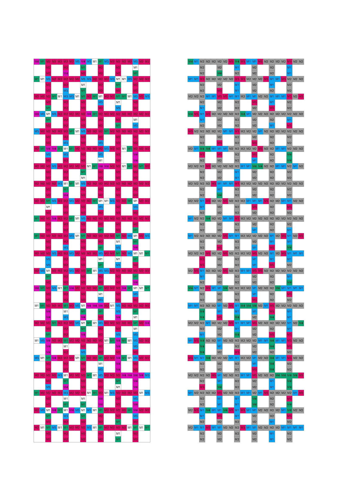

# Generative Entwurfswerkzeuge für gemeinschaftliche Wohnstrukturen und materialadaptive Fassadengestaltung

Dieses Repository enthält zwei Python-Skripte, die für **Rhino** entwickelt wurden.  
Sie dienen der **generativen Entwicklung von Strukturplänen für gemeinschaftliches Wohnen** sowie der **materialbasierten Gestaltung von Fassaden unter Verwendung von wiederverwendeten Stein- und Betonplatten (Reuse-Material)**.

Das zweite Skript baut direkt auf den Ergebnissen des ersten auf. Gemeinsam bilden sie einen **regelbasierten Entwurfsworkflow**, der die **Organisation des Innenraums** mit der **Gestaltung der Gebäudehülle** verbindet.

---

# Überblick

Das Projekt besteht aus zwei voneinander unabhängigen, jedoch logisch miteinander verbundenen Werkzeugen:

1. **Strukturplan-Generator**  
   Generiert verschiedene räumliche Organisationsformen für gemeinschaftliche Wohnstrukturen auf Basis definierter Regeln.

  

2. **Reuse-Fassadengenerator**  
   Nutzt die generierten Rasterstrukturen zur Entwicklung von Fassadenkompositionen auf Grundlage der **verfügbaren Mengen wiederverwendeter Stein- und Betonplatten**.

  

Beide Skripte sind in **Python für Rhino** implementiert und dienen als **Entwurfswerkzeuge zur Exploration verschiedener Varianten**.

---

# Skript 1 – Strukturplan-Generator

## Ziel

Das erste Skript generiert eine Vielzahl unterschiedlicher **räumlicher Strukturvarianten für gemeinschaftliche Wohnformen** (z. B. Wohngemeinschaften).

Die Grundrisse werden mithilfe eines **regelbasierten Systems innerhalb eines Rasters** erzeugt.  
Mehrere Parameter ermöglichen es dem Benutzer, die generierten Varianten gezielt zu steuern.

---

## Einstellbare Parameter

Der Benutzer kann unter anderem folgende Parameter anpassen:

- **Dimensionen des Rasters**
- **Größe des gemeinschaftlich genutzten Wohnzimmers**
- **Anzahl der privaten Zimmer**
- **Anzahl der zu generierenden Strukturpläne**
- **Grafische Darstellung der generierten Grundrisse**

Dadurch können zahlreiche räumliche Varianten erzeugt werden, während die zugrunde liegenden organisatorischen Prinzipien konstant bleiben.

---

## Regeln der räumlichen Organisation

Ausgehend von den Anforderungen gemeinschaftlichen Wohnens wurden folgende Regeln definiert.

### Grundelemente einer Wohngemeinschaft

Eine Wohngemeinschaft besteht aus:

- **Sanitäreinheiten**
- **Vorgelagerten Vorräumen**
- **Einem gemeinschaftlich genutzten Wohnzimmer**
- **Privaten Zimmern**

---

### Entwurfsregeln

Die generierten Strukturpläne müssen folgende Bedingungen erfüllen:

1. **Alle Räume müssen vollständig innerhalb des definierten Rasters liegen.**

2. **Maximal zwei Rasterfelder dürfen mit Sanitäreinheiten belegt werden.**

3. **Jeder Sanitäreinheit ist ein Vorraum vorzuschalten.**

4. **Das Wohnzimmer muss mit mindestens einem Rasterfeld an den Rand des Rasters angrenzen**,  
   um eine natürliche Belichtung sicherzustellen.

5. **Das Wohnzimmer muss direkt an den Vorraum anschließen.**

6. **Die privaten Zimmer müssen an das Wohnzimmer angebunden sein.**

7. **Die privaten Zimmer müssen mit mindestens einem Rasterfeld an den Rand des Rasters angrenzen**,  
   um eine natürliche Belichtung sicherzustellen.

---

## Implementierung

Die Umsetzung dieser Regeln erfolgt in einem **eigens entwickelten Python-Skript für Rhino**.  
Das Skript generiert gültige Strukturpläne und stellt diese als **grafische Rasterdarstellungen** dar.

---

# Skript 2 – Reuse-Fassadengenerator

## Ziel

Das zweite Skript erweitert die Logik des Strukturplan-Generators zur Unterstützung der **Entwicklung von Fassaden aus wiederverwendeten Stein- und Betonplatten**.

Da die **Verfügbarkeit dieser Materialien stark variieren kann**, ist eine **flexible und materialadaptive Entwurfslogik** erforderlich.  
Die grundlegenden Regeln der Fassadenkomposition bleiben dabei unabhängig vom verfügbaren Materialbestand konstant.

Das Skript ermöglicht es, **unterschiedliche Materialmengen in eine konsistente Fassadenkomposition zu überführen**.

---

## Konzept

Die zuvor generierten Strukturpläne bilden die **Grundlage der Fassadenentwicklung**.

Während die Rasterzellen ursprünglich **Raumtypen** repräsentieren, werden sie für die Fassadengestaltung neu interpretiert:

- Rasterzellen stehen nun für **verschiedene Kategorien von Stein- und Betonplatten**
- Jede Zelle repräsentiert einen **bestimmten Materialtyp**

Auf diese Weise basiert die Fassadengestaltung auf derselben strukturellen Logik wie die Organisation der Innenräume.

---

## Skalierung der Fassade

Um die Größe der Gesamtfassade abzubilden:

- können **mehrere Raster nebeneinander angeordnet werden**
- **Anzahl und Anordnung dieser Raster** können vom Benutzer frei definiert werden

Innerhalb jedes einzelnen Rasters gelten weiterhin die **Regeln des ursprünglichen Strukturplan-Generators**.

---

## Integration von Fassadenöffnungen

Bevor Materialien zugewiesen werden, werden **Fassadenöffnungen definiert**.
Diese Zellen repräsentieren beispielsweise **Fenster oder andere Öffnungen**.

---

## Materialeingabe

Die **zum Zeitpunkt der Planung verfügbaren Mengen an wiederverwendeten Stein- und Betonplatten** werden als Parameter in das Skript eingespeist.

Das Skript berechnet anschließend:

- die **Gesamtflächen der einzelnen Materialkategorien**
- die **Flächen der jeweiligen Zellwerte im Raster**

---

## Materialzuweisungsprozess

Die Zuordnung der Materialien erfolgt in mehreren Schritten:

1. **Berechnung der Gesamtfläche jeder Materialkategorie**
2. **Berechnung der Fläche der Rasterzellen je Kategorie**
3. **Sortierung von Materialien und Zellwerten nach Flächengröße**
4. **Zuweisung der Materialien zu den Rasterzellen entsprechend der verfügbaren Mengen**

Ist ein Material in ausreichender Menge vorhanden, kann es **mehreren Zellkategorien zugewiesen werden**.

Verbleibende **Restmengen werden separat ausgewiesen** und können für andere Anwendungen genutzt werden.

---

## Generativer Entwurfsprozess

Durch die wiederholte Generierung der Fassadenstruktur in Kombination mit einem **sich verändernden Materialangebot** entstehen unterschiedliche Fassadenanordnungen.

Dabei bleibt:

- das **Regelwerk konstant**
- die **Auswahl der finalen Konfiguration beim Benutzer**

---

# Entwurfskonzept

Der Ansatz stellt eine direkte Verbindung zwischen **Innenraumorganisation und Fassadengestaltung** her.

Sowohl:

- die **Grundrisse der Wohngemeinschaften**
- als auch die **Struktur der Fassade**

basieren auf **demselben regelbasierten System**.

Dadurch wird die Fassade zu einem **sichtbaren Ausdruck der inneren räumlichen Organisation**, während sie gleichzeitig auf die **Verfügbarkeit wiederverwendeter Baumaterialien** reagiert.

---

# Technologien

- **Python**
- **Rhino Python Script Editor**
- **Regelbasierte generative Entwurfsmethoden**

---

# Mögliche Anwendungen

- Untersuchung von **Typologien gemeinschaftlichen Wohnens**
- **Materialadaptive Fassadengestaltung**
- **Reuse-orientierte Architektur**
- **Computational Design Workflows**
- **Digitale Entwurfs- und Kommunikationsunterstützung in frühen Planungsphasen**

---
